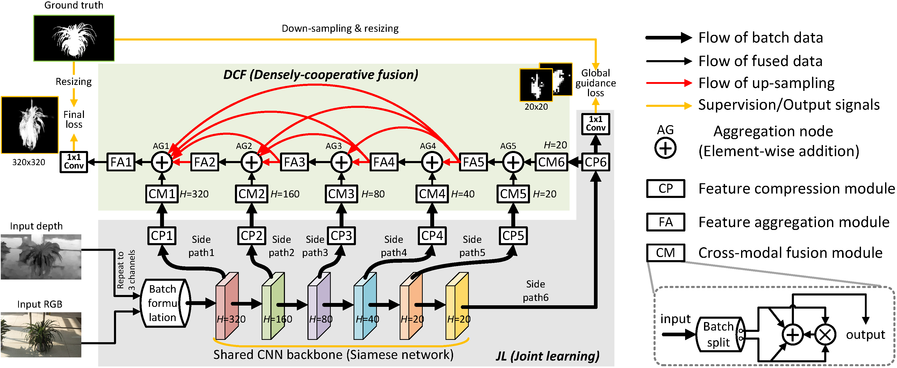

# JL-DCF (CVPR 2020)
JL-DCF: Joint Learning and Densely-Cooperative Fusion Framework for RGB-D Salient Object Detection   
(Code will come soon...)

## Usage
The original implementation of JL-DCF is Caffe. 

1. STEP1: To run the code, you should first install Caffe and also its MATLAB Interface. 

Suggested Caffe version from Github  
For Linux: https://github.com/BVLC/caffe  
For Windows: https://github.com/BVLC/caffe/tree/windows OR https://github.com/happynear/caffe-windows (the latter works more easily with Visual Studio project *.sln and is recommended to run our code for Windows users)  

Note that standard Caffe is enough for running our code! 

2. STEP2: Download the model of JL-DCF from the following links and have it in the "models" folder. 
链接：https://pan.baidu.com/s/1hHckF5PPtFXM52GaYNeuOw 提取码：nvoi
or:  
https://drive.google.com/open?id=185L3uULu0-GKWyLxE6S8X79pYYj6JUOg

3. STEP3: Open MATLAB, run demo_JLDCF.m and get the results in "results" folder.

## Results  
Results of our JL-DCF model on 7 benchmark datasets (NJU2K, NLPR, STERE, RGBD135, LFSD, SIP, DUT-RGBD) can be found below:  
链接: https://pan.baidu.com/s/1NGaoZbmPKDr1auMtO0syFQ 提取码: osnf  
or:  
https://drive.google.com/open?id=1I_2i5XbjTdAVfgOh4wpfV3EuqVaXRQH0

References of datasets:  
  [STERE] Leveraging stereopsis for saliency analysis. In CVPR 2012.  
  [NJU2K] Depth saliency based on anisotropic centersurround difference. In ICIP 2014.  
  [NLPR] Rgbd salient object detection: A benchmark and algorithms. In ECCV 2014.  
  [RGBD135] Depth enhanced saliency detection method. In International Conference on Internet Multimedia Computing and Service. ACM, 2014.  
  [LFSD] Saliency detection on light field. In CVPR 2014.  
  [DUT-RGBD] Depth-induced multi-scale recurrent attention network for saliency detection. In ICCV 2019.  
  [SIP] Rethinking RGB-D salient object detection: Models, datasets, and large-scale benchmarks. IEEE TNNLS, 2020.  

## Dataset
Our training dataset is  
链接: https://pan.baidu.com/s/1uF6LxbH0RIcMFN71cEcGHQ 提取码: 5z48  
or:  
https://drive.google.com/open?id=1BpVabSlPH_GhozzRQYjxTOT_cS6xDUgf

## Citation
Please cite our paper if you find the work useful: 

	@inproceedings{Fu2020JLDCF,
  	title={JL-DCF: Joint Learning and Densely-Cooperative Fusion Framework for RGB-D Salient Object Detection},
  	author={Fu, Keren and Fan, Deng-Ping and Ji, Ge-Peng and Zhao, Qijun},
  	booktitle={IEEE Conference on Computer Vision and Pattern Recognition (CVPR)},
  	year={2020}
	}
  
## Benchmark RGB-D SOD
The complete RGB-D SOD benchmark can be found in this page  
http://dpfan.net/d3netbenchmark/
